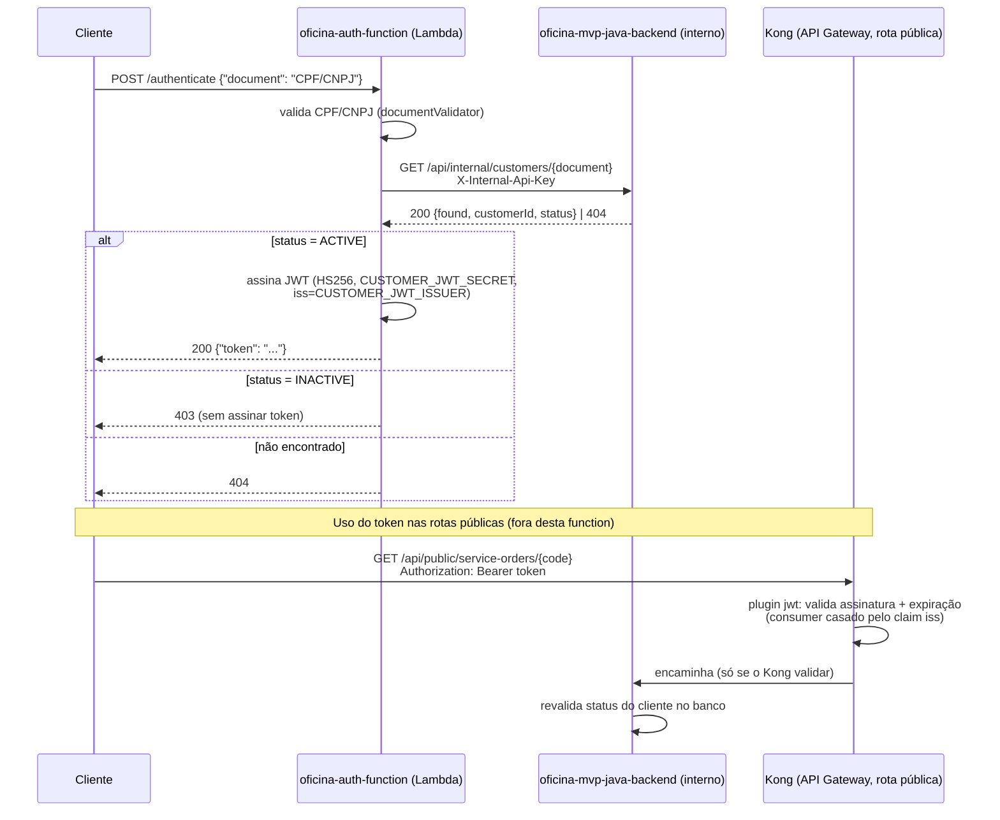

# oficina-auth-function

Function Serverless de autenticação via CPF/CNPJ para o
[`oficina-mvp-java-backend`](https://github.com/lukebria/oficina-mvp-java-backend) (backend da oficina mecânica),
repositório 1/4 do Tech Challenge Fase 3. Fica atrás do **AWS API Gateway (HTTP API)**, rota `POST /authenticate`,
e:

1. valida o CPF/CNPJ informado pelo cliente;
2. consulta `GET /api/internal/customers/{document}` no backend Java para confirmar existência/status do cliente;
3. assina e devolve um JWT válido para consumir as rotas públicas de OS do backend
   (`GET /api/public/service-orders/{code}`, `POST /api/public/service-orders/{code}/approval`). Essas rotas ficam
   atrás do **Kong** (o API Gateway da aplicação), que valida o mesmo JWT antes de repassar (ADR-006).

### Estado atual (2026-10-05)

- ✅ **Validado em ambiente real** (04/10 e 05/10): `POST /authenticate` → `400` (CPF inválido), `404` (cliente
  inexistente), `200` + JWT (cliente válido); o JWT é aceito pelo Kong e recusado quando adulterado. A Lambda sobe
  com a layer da New Relic (`NewRelicNodeJS22X:108`).
- O ambiente **não fica ligado** (crédito limitado do AWS Academy): é recriado para testes e para a gravação.
  Passo a passo: **runbook do projeto** (`runbook/RUNBOOK.md` no repositório de specs). A URL da API muda a cada
  recriação; `BACKEND_BASE_URL` precisa apontar para o Kong do momento (`node wire-endpoints.js kong`).
- **Chave `DEPLOY_ENABLED`**: com `false` (padrão) os merges só rodam os testes; com `true` (ou disparo manual)
  fazem deploy. Ver [CI/CD](#cicd-github-actions).

### Como chamar (quando o ambiente estiver de pé)

```bash
# URL atual da API (muda a cada recriação)
aws apigatewayv2 get-apis --query "Items[?Name=='oficina-auth-function-api'].ApiEndpoint" --output text
curl -X POST "<ApiEndpoint>/authenticate" -H "Content-Type: application/json" -d '{"document":"52998224725"}'
```
```powershell
Invoke-RestMethod -Method Post -Uri "<ApiEndpoint>/authenticate" -ContentType "application/json" -Body '{"document":"52998224725"}'
```

Pelo console da AWS: **API Gateway → `oficina-auth-function-api`** (rota `POST /authenticate`, *Stages* → URL) e
**Lambda → `oficina-auth-function` → aba Test**, com o evento `{"body": "{\"document\":\"52998224725\"}"}`
(aba *Monitor* → logs no CloudWatch). O token devolvido é usado em
`GET http://<DNS do Kong>/api/public/service-orders/<código>` com `Authorization: Bearer <token>`.

## Stack

- Node.js LTS (22.x ou mais recente) + TypeScript.
- `jose` para assinatura JWT (HS256).
- `fetch` nativo do Node para chamar o backend — sem dependência extra de HTTP client.
- Jest + `ts-jest` para testes.

## Arquitetura: núcleo genérico + adapter fino por provedor

```
src/
  core/            regra de negócio pura — não importa AWS, HTTP nem a lib de JWT diretamente
    domain/errors.ts
    documentValidator.ts   porta em TS de DocumentValidator.java (mesmo algoritmo, mesma normalização)
    ports.ts                CustomerStatusPort, TokenSignerPort — interfaces que o núcleo consome
    authenticateByDocument.ts   caso de uso: valida -> consulta status -> assina token
  adapters/        implementações concretas das portas
    config.ts                      lê/valida variáveis de ambiente
    customerStatusHttpClient.ts    CustomerStatusPort via fetch
    jwtTokenSigner.ts               TokenSignerPort via jose (HS256)
  handlers/
    aws/authenticateHandler.ts     adapter fino: evento do API Gateway -> core -> resposta HTTP
```

O núcleo (`core/`) não sabe que roda em AWS Lambda. Portar para outro provedor serverless (ex: Google Cloud
Functions, que o autor deste projeto já usou antes) é escrever um novo arquivo em `handlers/<provedor>/`, chamando
o mesmo `authenticateByDocument` com as mesmas portas — sem tocar em `core/` nem nos `adapters/`.

## Diagrama de arquitetura



Infraestrutura provisionada (ver [Deploy (Terraform)](#deploy-terraform)): API Gateway HTTP API própria desta
function (distinta do Kong que protege a aplicação principal) → Lambda → CloudWatch Logs (estruturados em
JSON, ver [Observabilidade e logs](#observabilidade-e-logs)).

## Contrato com o backend `oficina-mvp-java-backend`

Ver [`docs/architecture.md`](https://github.com/lukebria/oficina-mvp-java-backend/blob/master/docs/architecture.md)
(seção 5, "Segurança") no repositório `oficina-mvp-java-backend` — este documento vive naquele repositório, não
neste — e o `README.md` de lá para o lado que já está implementado. Resumo do que esta function precisa
respeitar:

| Item | Valor |
|------|-------|
| Endpoint de consulta | `GET {BACKEND_BASE_URL}/api/internal/customers/{document}` |
| Autenticação da consulta | Header `X-Internal-Api-Key: <INTERNAL_API_KEY>` (mesmo valor do backend) |
| Resposta (cliente existe) | `200 {"found": true, "customerId": number, "name": string, "status": "ACTIVE" \| "INACTIVE"}` |
| Resposta (não existe) | `404 {"found": false, "customerId": null, "name": null, "status": "NOT_FOUND"}` |
| Algoritmo do JWT | HS256 |
| Segredo do JWT | `CUSTOMER_JWT_SECRET` — **precisa ser o mesmo valor** configurado no backend **e no Kong** (`oficina-mvp-infra-iac`), nunca o `JWT_SECRET` administrativo |
| Claims do JWT | `sub` = documento normalizado (só dígitos), `role` = `"CUSTOMER"`, `iss` = `CUSTOMER_JWT_ISSUER` (default `"customer-app"`) |
| Validade do JWT | Curta — default 15 min (`TOKEN_TTL_SECONDS`), token serve só para consultar/aprovar uma OS |

Um cliente `INACTIVE` nunca recebe token — a function responde `403` antes de chamar o assinador.

### Validação do token nas rotas protegidas — API Gateway (Kong) + aplicação

O claim `iss` existe para o **Kong** (API Gateway da aplicação principal) conseguir validar a assinatura e a
expiração do token **antes mesmo de rotear a requisição para o backend** — via o plugin `jwt` nativo do Kong,
configurado em `oficina-mvp-infra-iac` com um `KongConsumer` cujo `username` é igual a este `iss`. É uma decisão
de defesa em profundidade: o Kong barra tokens inválidos/expirados na borda, e o backend **continua também**
validando o token e revalidando o status do cliente no banco a cada request (não foi removido nada da
aplicação) — ver ADR-006 em `oficina-mvp-java-backend/docs/architecture/adrs/`.

## Variáveis de ambiente

Ver `.env.example`:

- `BACKEND_BASE_URL` — URL base do backend Java (sem barra final).
- `INTERNAL_API_KEY` — mesma chave configurada em `INTERNAL_API_KEY` no backend.
- `CUSTOMER_JWT_SECRET` — mesmo segredo configurado em `CUSTOMER_JWT_SECRET` no backend e no Kong.
- `CUSTOMER_JWT_ISSUER` — claim `iss` do token; precisa bater com o `username` do `KongConsumer` no Kong (default `customer-app`).
- `TOKEN_TTL_SECONDS` — validade do token emitido, em segundos (default `900`).

## Rodando localmente

```bash
npm install
cp .env.example .env   # preencher com os mesmos valores do backend
npm run typecheck
npm test
```

## Handler AWS Lambda

`src/handlers/aws/authenticateHandler.ts` espera ser configurado como o handler de uma função Lambda por trás de
um API Gateway (proxy integration), recebendo `POST` com corpo:

```json
{ "document": "12345678909" }
```

Respostas:

| Situação | HTTP | Corpo |
|----------|------|-------|
| Documento ausente/mal formatado no request | 400 | `{"message": "..."}` |
| CPF/CNPJ inválido | 400 | `{"message": "..."}` |
| Cliente não encontrado | 404 | `{"message": "..."}` |
| Cliente inativo | 403 | `{"message": "..."}` |
| Sucesso | 200 | `{"token": "<jwt>"}` |
| Erro inesperado (ex: backend fora do ar) | 500 | `{"message": "..."}` |

### Testando com curl / Postman

```bash
curl -X POST "$API_ENDPOINT/authenticate" \
  -H "Content-Type: application/json" \
  -d '{"document": "52998224725"}'
```

Como a function tem um único endpoint, não há uma collection Postman elaborada — importar a requisição acima
diretamente no Postman/Insomnia cobre o mesmo caso de uso. `$API_ENDPOINT` é o output `api_endpoint` do
Terraform (ver seção seguinte).

## Observabilidade e logs

Logs estruturados em JSON (`src/adapters/logger.ts`), correlacionados pelo `requestId` do próprio API Gateway
(`event.requestContext.requestId`) — cada linha no CloudWatch Logs é um objeto `{level, message, requestId,
timestamp, ...}`, filtrável/agrupável por requisição. O documento (CPF/CNPJ) nunca é logado em texto puro — só
`customerId` no log de sucesso.

Métricas básicas (invocações, duração, erros) já ficam disponíveis via CloudWatch por padrão, no log group
`/aws/lambda/<function_name>` (retenção configurável via `log_retention_days`).

**New Relic (opcional)**: `terraform/main.tf` já suporta anexar a New Relic Lambda Extension e configurar
`NEW_RELIC_ACCOUNT_ID`/`NEW_RELIC_LICENSE_KEY` — tudo condicional às variáveis `new_relic_account_id`,
`new_relic_license_key` e `new_relic_lambda_layer_arn` (vazias por padrão = nada é anexado/configurado). Para
ativar de verdade: preencher essas três variáveis (o ARN da layer é específico de região/conta — conferir o
valor atual na [documentação da New Relic](https://docs.newrelic.com/docs/serverless-function-monitoring/aws-lambda-monitoring/enable-lambda-monitoring/nodejs-agent-install)
antes de configurar). A extension sozinha já cobre invocações/duração/erros; tracing distribuído completo
exigiria trocar o handler para o wrapper da New Relic — não feito aqui de propósito, é um passo manual
adicional para quando alguém for ativar isso com uma conta real (o nome exato do pacote wrapper muda com a
versão do agente).

## Deploy (Terraform)

A infraestrutura desta function (Lambda + API Gateway) é provisionada pelo Terraform em [`terraform/`](terraform)
— totalmente independente do Terraform que provisiona o cluster EKS/ECR do backend
([`oficina-mvp-infra-iac`](https://github.com/lukebria/oficina-mvp-infra-iac)); esta function não roda dentro
daquele cluster.

### Pré-requisitos

- Terraform >= 1.5.
- Credenciais AWS configuradas (`aws configure` ou variáveis `AWS_ACCESS_KEY_ID`/`AWS_SECRET_ACCESS_KEY`/`AWS_SESSION_TOKEN`).
- Node.js instalado — o próprio `terraform apply` compila e empacota a function antes de subir o zip (ver
  `scripts/build-lambda.js`).

### O que é provisionado

- `aws_lambda_function` (`nodejs22.x`), handler `src/handlers/aws/authenticateHandler.handler`.
- IAM: usa a `LabRole` já existente no AWS Academy Learner Lab (o Lab não permite criar IAM Roles) — ela confia em `lambda.amazonaws.com` e cobre os logs no CloudWatch.
- Log group no CloudWatch (`/aws/lambda/<function_name>`).
- Uma **HTTP API** (API Gateway v2, `payload_format_version = "1.0"` para bater com o formato
  `APIGatewayProxyEvent` que o handler já espera) com a rota `POST /authenticate`.

O empacotamento (`terraform/build.tf`) roda `npm run build` e monta o zip com `dist/src/**` + `node_modules/jose`
— sem bundler, porque `jose` não tem dependências transitivas. Só reroda quando o código-fonte, o
`package-lock.json` ou o `tsconfig.json` mudam.

### Como rodar

```bash
cd terraform
cp terraform.tfvars.example terraform.tfvars   # preencher com os valores reais — nunca commitar este arquivo
terraform init
terraform plan
terraform apply
```

Ao final, o output `api_endpoint` traz a URL pública (`POST`) que consome o handler.

### Tags dos recursos (o que é cada coisa no console)

Todo recurso AWS criado por este repositório leva as **tags comuns do projeto** (`default_tags` do provider):
`Project=oficina-mvp` (igual nos 3 repos de Terraform), `Repository=oficina-auth-function`, `Component=autenticacao`,
`Environment=lab`, `ManagedBy=terraform`, `Course=FIAP POSTECH 13SOAT - Tech Challenge Fase 3`. Além delas,
cada recurso tem **`Name`** (o que aparece na coluna *Name* do console) e **`Description`**:

| `Name` | Recurso | `Description` |
|---|---|---|
| `oficina-mvp-auth-lambda` | Lambda `oficina-auth-function` | Login por CPF: valida o cliente no backend e emite o JWT (também no campo *Description* da Lambda) |
| `oficina-mvp-auth-api` | API Gateway (HTTP API) `oficina-auth-function-api` | Endpoint público `POST /authenticate` (também no campo *Description* da API) |
| `oficina-mvp-auth-logs` | Log group `/aws/lambda/oficina-auth-function` | Logs da Lambda |

Para ver **todos** os recursos do projeto numa tela só: console AWS → **Resource Groups & Tag Editor → Tag Editor**
→ Region `us-east-1`, Resource types `All supported`, Tag `Project` = `oficina-mvp` → *Search resources*.
Os nomes técnicos (`oficina-mecnica-lab-...`, com o erro de digitação histórico) foram mantidos para não recriar
recursos nem quebrar pipelines; a tag `Name` é o nome legível.

### CI/CD (GitHub Actions)

- **`ci.yml`** — em PR para `homolog`/`master`: `npm ci` → `typecheck` → `test`. Não toca em infra.
- **`deploy.yml`** — em push para `homolog`/`master` (ou disparo manual): testes → `npm run package:lambda`
  (compila e monta `terraform/.build/lambda`, necessário mesmo para o `terraform plan` — o provisioner
  `local-exec` do `build.tf` só roda no `apply`) → `terraform init/plan/apply`, seguindo o git flow do projeto.

**Chave de deploy — variable `DEPLOY_ENABLED`** (o crédito do AWS Academy é limitado; detalhe em
`plans/10-chave-deploy-enabled.md` no repositório de specs):
- `true` → em push para `homolog`/`master`, executa automaticamente o job `deploy` (build + `terraform init/plan/apply`) (deploy automático de homologação e
  produção, como pede o enunciado).
- `false` ou ausente → o pipeline roda só o que não depende da AWS e **pula** (*skipped*) o job `deploy` (build + `terraform init/plan/apply`). É o estado
  padrão fora de uma janela de deploy, para um merge não subir recursos pagos.
- **Disparo manual** (*Actions → Run workflow*) ignora a chave: rodar pelo botão já é uma decisão explícita.
- Ligar/desligar: *Settings → Secrets and variables → Actions → Variables → `DEPLOY_ENABLED`*.

GitHub Secrets/Variables (`AWS_ACCESS_KEY_ID`, `AWS_SECRET_ACCESS_KEY`, `AWS_SESSION_TOKEN`,
`AWS_DEFAULT_REGION`, `BACKEND_BASE_URL`, `INTERNAL_API_KEY`, `CUSTOMER_JWT_SECRET`) configurados em 2026-10-04 —
os 3 secrets AWS expiram a cada sessão do Learner Lab e `BACKEND_BASE_URL` muda a cada recriação do Kong. `INTERNAL_API_KEY`/`CUSTOMER_JWT_SECRET`
precisam ser **idênticos** aos configurados no repositório `oficina-mvp-java-backend`.

### State remoto

Backend S3 (`terraform/backend.tf`), reaproveitando o **mesmo bucket** de state do `oficina-mvp-infra-iac`
(`oficina-mvp-tfstate-536036031274`, key própria: `oficina-lab/auth-function/terraform.tfstate`) e a **mesma tabela DynamoDB** de lock
(`oficina-mvp-infra-iac-tf-lock`, compartilhada entre os states — não colide porque o `LockID` inclui
bucket+key). 🔗 **Dependência de ordem**: essa tabela só existe depois que `oficina-mvp-infra-iac` aplicar seu
`dynamodb.tf` — rodar `terraform init` aqui antes disso falha por falta da tabela de lock.

### Melhorias para um ambiente de produção real (fora do escopo do desafio)

O que está em `terraform/` atende o ambiente de lab do desafio (validado em 2026-10). Os valores
(`backend_base_url`, `internal_api_key`, `customer_jwt_secret`) chegam via `TF_VAR_*` do pipeline, a partir dos
GitHub Secrets/Variables já configurados; para rodar local, vêm de `terraform.tfvars` (modelo em
`terraform.tfvars.example`). Para produção de verdade, ainda caberia:

- **CORS na HTTP API** — se algum frontend for chamar `POST /authenticate` direto do navegador, falta configurar
  `cors_configuration` em `aws_apigatewayv2_api`.
- **Rate limiting/throttling** — o endpoint recebe CPF/CNPJ como entrada; sem limite de requisições por IP/chave
  na API Gateway (ou WAF na frente), fica exposto a tentativas de enumeração de documentos.
- **Domínio customizado + certificado ACM** — hoje a URL fica no domínio padrão do API Gateway
  (`*.execute-api.<região>.amazonaws.com`); um domínio próprio é opcional, mas comum em produção.

Nenhum desses pontos é exigido pelo enunciado; ficam registrados como próximos passos de produção.

## Fora de escopo deste repositório (por enquanto)

- Empacotamento otimizado para cold start (bundling com esbuild) — o zip inclui `node_modules/jose` sem
  minificação/tree-shaking.
- Handler para outro provedor serverless (a estrutura já deixa espaço em `handlers/`, mas nenhum outro foi
  escrito ainda).
